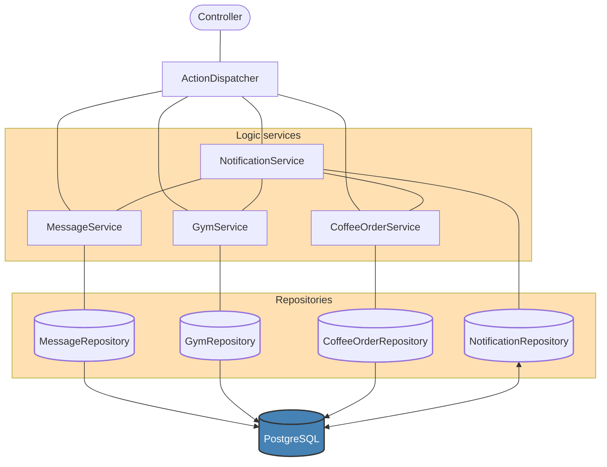

# Unpredictable notificator

Проект реализует событийно-ориентированную систему для анализа активности пользователей и эвристической генерации "умных" уведомлений на основе закономерностей поведения пользователей.

## Aрхитектурa и ключевые классы

Проект представляет собой классическое решение с многослойной архитектурой:
1) Controllers. Два REST-контроллера GetDataController (с единственным методом обработки action) и PostDataController (с единственным методом вывода всех id созданных нотификаций)
2) Request Dispatcher. Класс ActionDispatcher подбирает service-исполнитель для обработки реквеста.
3) Logic services. Классы MessageService, CoffeeService, ReminderService, GymService, TicketService, NotificationService реализуют логику обработки соответствующего action и реализации условий отправления "умных" уведомлений.
4) Repositories. Классы MessageRepository и прочие реализуют слой database DAO
> Классы связанные с одной из реализаций умного уведомления выделены в отдельные пакеты Task#, так как между собой они не взаимодействуют, сделано только для удобства:
>  **Task1** - пример 1, сообщения три ночи подряд (покрыт тестами)
>  **Task2** - пример 2, покупка кофе (покрыт тестами)
>  **Task3** - уведомление-напоминание
>  **Task4** - занятие в спортзале (покрыт тестами)
>  **Task5** - покупка билета

## "Эвристика непредсказуемости"

1. **Message service**. Полностью построен на примере, эвристика реализована на том, что уведомление отправляется, когда первый пользователь написал сообщение после определенного момента утром (параметр app.message.morningStart), после этого пользователя, сообщения только записываются в БД, и если это сообщение ночное сервис проверяет является ли сообщение последним "третьим в ряд". Если да - помечаем - оно попадет в выборку при следующем утреннем сообщении.
2. **Coffee order service**. Уведомление отправляется сразу после заказа в последний из необходимых для полного набора дней, нужных для получения скидки. Добавлена логика настройки в конфигах  этого набора дней (параметр app.coffee.daysOfWeekToCheck) и дня, когда скидка работает (параметр app.coffee.dayOfWeekOfDiscount).
3. **Reminder service**. Action - установка напоминания на определенный временной интервал. Требуется передача уведомления по окончании интервала. Напоминание неточное (с точностью до минуты), поэтому не назвал его будильником :) Самая "неудачная" задача, логики интересной нет - на виртуальном треде запускаем poller и проверяем по записям в бд, есть ли истекшие - по найденным производим уведомления.
4. **Gym service**. Action - отметка о начале занятия в спортзале, либо об окончании если с последнего занятия с неотмеченным окончанием прошло меньше времени, чем максимально отведенное время на занятие (параметр app.gym.maxLessonDurationInMinutes). Уведомление передается, если отношение длительности закончившегося только что занятия и предпоследнего больше чем определенное значение (зависит от параметра app.gym.percentageDifferenceForNotification). Уведомление отправляется сразу после окончания такого занятия. Не допускается длительность занятия меньше определенного промежутка (параметр app.gym.minLessonDurationInMinutes, запись удаляется), также продуман момент удаления записи занятия при превышении максимальной длительности через проверку в фоновом треде.
5. **Ticket service**. Action - отметка о покупке транспортного билета.  Если куплено определенное количество билетов (параметр app.ticket.monthlyTripsForDiscount) за последний месяц, высылаем уведомление со скидкой на следующую поездку. Билеты, участвующие в активации скидки отмечаются флагом и не участвуют в следующей проверке.
> Упомяну сервис NotificationService, в котором продумана удобная настройка темплейтов сообщений для каждого сервиса через конфиг.

## Примеры запросов и ответов
**Запрос**

      Post /action
        {
    	    "userId"  :  1,
    	    "actionType"  :  "wrongAction",
    	    "timestamp"  :  1763715356000
        }`
Ответ

     Code: 500
     Couldn't get response: Зарегистрирован тип неизвестного сообщения - wrongAction
**Запрос**

	    Post /action
        {
    	    "userId"  :  1,
    	    "actionType"  :  "reminder5",
    	    "timestamp"  :  1763715356000
        }`
Ответ

	    Code: 200
	    Action registered!
**Запрос**

	    Get /notifications
Ответ

        {
            "9":  {
                "userId":  5,
                "message":  "Вы проехали уйму поездок за последний месяц ?, следующая поездка будет бесплатной",
                "ts":  1764093905000
            },
            "8":  {
                "userId":  4,
                "message":  "Ваше занятие длилось заметно дольше предыдущего! Так держать! ?",
                "ts":  1764091505000
            },
            "4":  {
                "userId":  3,
                "message":  "Заметили, вы часто покупаете кофе по пятницам, средам и понедельникам, держите купон на скидку во вторник!",
                "ts":  1763745005000
            },
            "6":  {
                "userId":  2,
                "message":  "Очень надеюсь, что вы помните для чего вы оставили это напоминание ?",
                "ts":  1763400023868
            },
            "5":  {
                "userId":  1,
                "message":  "Очень надеюсь, что вы помните для чего вы оставили это напоминание ?",
                "ts":  1763399723818
            },
            "3":  {
                "userId":  1,
                "message":  "Кажется, вы сова ?",
                "ts":  1763361713000
            }
        }
